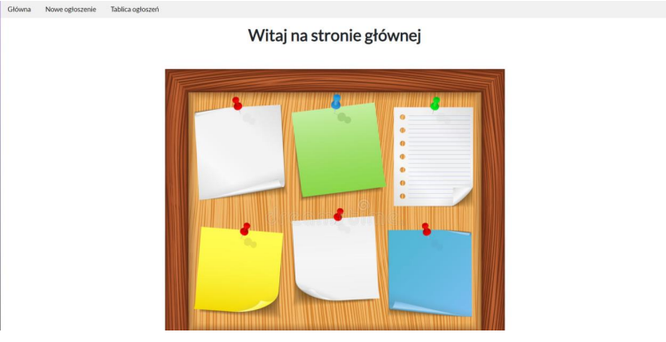
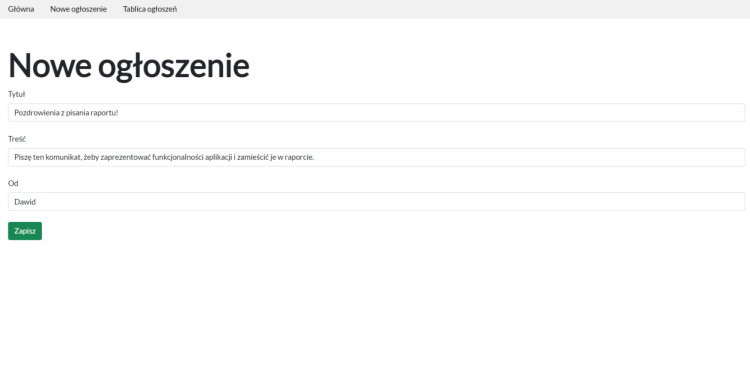
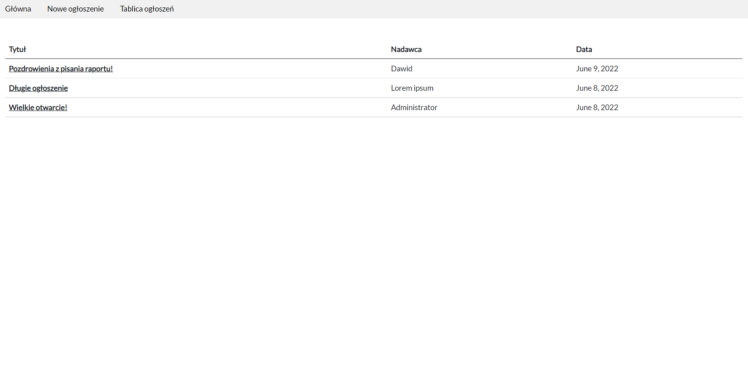
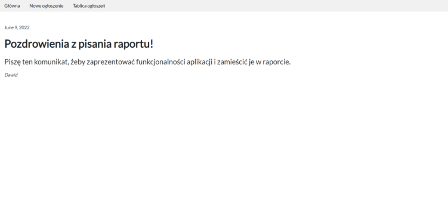

*This is an upload/archive of my older school project.*

A Django project of a noticeboard app.

Main technologies used:
- Python
- Django 4.0
- HTML
- CSS
- W3.CSS
- SQLite3

Sample screenshots:

